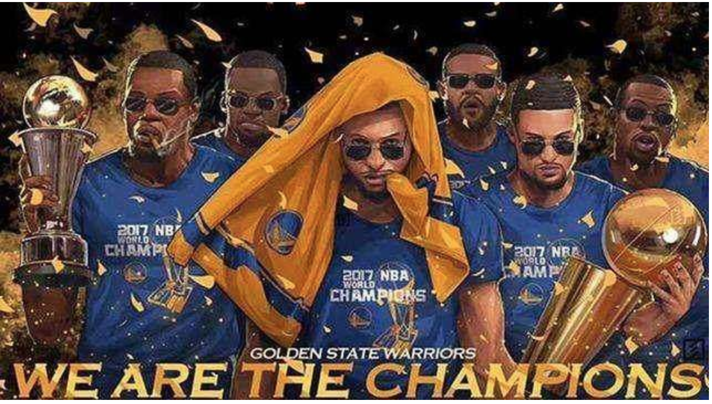
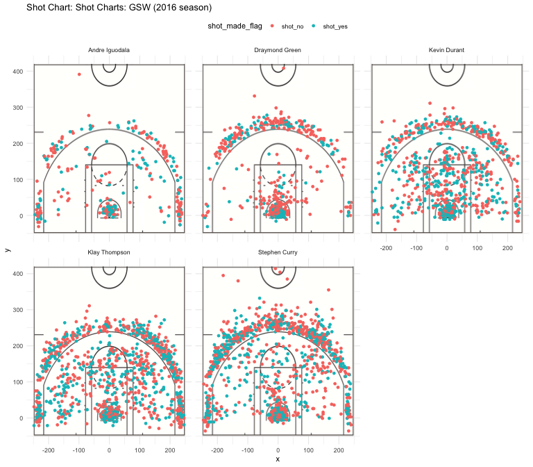

Workout01-Jian-Liu
================
Jian Liu
3/12/2019

The secret of the success of the Golden State Warriors!
=======================================================



### Introduction

Shooting is the most important thing in basketball. The Warriors do it more effectively than any other team in history, and that remains the most critical aspect of their quest to win their third championship in the last four years. Therefore, this report presents a data analysis on the main five players of the Golden State Warriors in 2016-2017 season in order to help people understand the reasons behind the victories of the Warriors.

### Data

In the data preparation stage, I first downloaded the season 2016 data of the main five players of the Warriors, Andre Iguodala, Draymond Green, Kevin Durant, Klay Thompson, and Stephen Curry separately from the course github repository and combined them as a main data frame after some modifications to make the main data frame contain the required variables to be used in the visualization phase.

### Analysis

##### 1.Shots Charts

-   Using the court coordinates where the shots occurred from the main data frame and the image of an NBA basketball court, I create five shot charts for the five players, and it’s showed below: 
-   From the comparison of the shot density, one can see that Kevin Durant, Klay Thompson, and Stephen Curry were the main shooters. On the other hand, Andre Iguodala and Draymond Green shot much less than the other three starting lineup members.
-   Stephen Curry and Klay Thompson came to be known as the Splash Brothers, and their shots charts looked very similar. Also, they seemed have similar overall effective shooting percentage. However, one can tell from the distributions of Curry’s shots that he focused more on 3-point shot, and his 3-point field goal effective shooting percentage was quite high. Thompson’s shots chart showed more balance between the number of 2-point and 3-point shots.
-   In contrast to Curry, Durant focused more on 2-point shot, and he seemed to have high effective field goal percentage in both 2-point and 3-point shots. Therefore, it’s reasonable to conclude that Durant and Curry had different shooting style. Comparing to other players, Green’s field goal effective shooting percentage seemed to be lower.

##### 2.Field Goal Effective Shooting Percentage

-   Since the shots charts can only provide a roughly visualization of their shots, I created three quantitative tables summarized their field goal effective shooting percentage regarding to overall shots, 2-point shots, and 3-point shots.

-   2PT Effective Shooting % by Player

<!-- -->

    ## # A tibble: 5 x 4
    ##   name           total_2pt  made perc_made
    ##   <chr>              <int> <int>     <dbl>
    ## 1 Andre Iguodala       210   134      63.8
    ## 2 Kevin Durant         643   390      60.6
    ## 3 Stephen Curry        563   304      54  
    ## 4 Klay Thompson        640   329      51.4
    ## 5 Draymond Green       346   171      49.4

    ## [1] "Mean of 2PT made shot proportion : 55.858"

-   Surprisingly, Andre Iguodala had the highest 2PT effective shooting percentage which was 63.81%, and Kevin Durant, with 60.65%, was the second highest. But we can see from the total attempted 2PT shots that Iguodala didn’t shoot as much as other players. Curry, Thompson, and Green were corresponding to the No.3, No.4, and No.5 in the 2PT effective shooting percentage ranking.
-   Except Green, all other players had a field goal effective percentage higher than 50%, and Draymond Green was 49.42% which was very close to 50%. The mean of these five players’ 2PT effective shooting percentage was 55.86%, which was much higher than the league average, roughly 46% (from Basketball Reference.com).

-   3PT Effective Shooting % by Player:

<!-- -->

    ## # A tibble: 5 x 4
    ##   name           total_3pt  made perc_made
    ##   <chr>              <int> <int>     <dbl>
    ## 1 Klay Thompson        580   246      42.4
    ## 2 Stephen Curry        687   280      40.8
    ## 3 Kevin Durant         272   105      38.6
    ## 4 Andre Iguodala       161    58      36.0
    ## 5 Draymond Green       232    74      31.9

    ## [1] "Mean of 3PT made shot proportion : 37.938"

-   Klay Thompson, Stephen Curry, and Kevin Durant were the top 3 players having the highest 3PT field goal effective shooting percentage. Andre Iguodala’s 3PT shots was not as accurate as his 2PT shots. The mean of their 3PT effective shooting percentage was 37.93%, which was still higher than the league average, roughly 35.5% (from Basketball Reference.com).

-   Effective shooting percentage

<!-- -->

    ## # A tibble: 5 x 4
    ##   name           total  made perc_made
    ##   <chr>          <int> <int>     <dbl>
    ## 1 Kevin Durant     915   495      54.1
    ## 2 Andre Iguodala   371   192      51.8
    ## 3 Klay Thompson   1220   575      47.1
    ## 4 Stephen Curry   1250   584      46.7
    ## 5 Draymond Green   578   245      42.4

    ## [1] "Mean of overall made shot proportion : 48.418"

-   Since Kevin Durant was accurate at both 2PT and 3PT shots, his overall field goal effective shooting percentage was the highest among these five people. Because of the high accuracy of 2PT shots and the fewest attempted shots among other players, Andre Iguodala had the second highest overall effective shooting percentage. The overall effective shooting percentages between Klay Thompson and Stephen Curry were very close, only 0.31% difference. And Draymond Green’s overall accuracy was the lowest comparing to other four GSW players. The mean of their overall effective shooting percentage was about 48.16%, which was still a very accuracy among the league.
-   About 70% (643 out of 915) of Durant’s attempted shots was 2PT shot, which only accounted for 45% of Curry’s total shots. This suggests that Durant indeed preferred 2PT shot than 3PT shot, and Curry was on the opposite. Also, among 1220 total shots of Thompson, roughly 52.5% (640/1220) of them were 2PT shots. So, Thompson shot 2PT approximately as much as 3PT.

##### 3.Points Per Shot(PPS)

-   Since I was also interested in the points per shot(PPS), I calculated the PPS of these five GSW starting lineup members by summing the points of both made 2PT and 3PT shots and dividing it by the total number of attempted shots for all five players.

-   Points Per Shot (PPS)

``` r
(sum(two$made * 2) + sum(three$made * 3))/ sum(overall$total)
```

    ## [1] 1.140978

-   NBA teams average 1.11 points per shot (PPS). The five main players of GSW, exceed that mark by averaging 1.14 PPS.

##### 4.Shooting Distance and Made Shot

-   Besides the effective shooting percentage and points per shot analysis, I also wanted to look at the relationship between shooting distance and made shot. Therefore, I made a table consisting of shooting distance and corresponding proportion of made shot. The table is as follow:

-   Table of Shooting Distance and the Corresponding Made Shots

<!-- -->

    ## # A tibble: 56 x 2
    ##    shot_distance percentage_of_made_shot
    ##            <int>                   <dbl>
    ##  1             0                    84.1
    ##  2             1                    66.8
    ##  3             2                    53.4
    ##  4             3                    37.4
    ##  5             4                    41.1
    ##  6             5                    28.6
    ##  7             6                    39.6
    ##  8             7                    39.5
    ##  9             8                    46.3
    ## 10             9                    32.1
    ## # … with 46 more rows

-   To better visualize the relationship, a scatterplot with these two variables is presented as follow: 

-   Based on the obtained scatterplot, we can observe a decreasing trend between shooting distance and proportion of made shots, and the percentages of shot made between 0 to 2 ft are over 50%. This means that the shot made inside 2 ft has a very high probability to be success. The plots from 3 to 32 ft are randomly fluctuate between 26% to 51%. After 33 ft, the percentage of made shot are zero. It means that the chance to make a shot after 33 ft is extremely low.
-   From this graph we can conclude that as the distance of shots gets smaller, the proportion of made shots increases.
-   However, there is a successful shot made from 51ft. We can consider this as an outlier and remove it before further analysis.
-   Removing outlier

``` r
outlier <- distanceVSshot_yes$shot_distance > 40 & distanceVSshot_yes$percentage_of_made_shot == 100
distanceVSshot_yes[outlier,]
```

    ## # A tibble: 1 x 2
    ##   shot_distance percentage_of_made_shot
    ##           <int>                   <dbl>
    ## 1            51                     100

``` r
distanceVSshot_yes <- distanceVSshot_yes[!outlier,]
```

-   The following table shows the distances that tend to have a 50% or higher percentage of made shot.

<!-- -->

    ## # A tibble: 8 x 2
    ##   shot_distance percentage_of_made_shot
    ##           <int>                   <dbl>
    ## 1             0                    84.1
    ## 2             1                    66.8
    ## 3             2                    53.4
    ## 4            12                    50  
    ## 5            16                    53.3
    ## 6            18                    52.8
    ## 7            21                    51.1
    ## 8            30                    50

-   We can see from the table that the close-range (0-2ft), and the mid-range (12-30ft) are the distances that tend to have a 50% or higher percentage of made shot.

### Conclusion

By data visualized analysis of each of the five main players of GSW in season 2016 and comparing their data to the league average, we can conclude that the Warriors, a team stacked with
